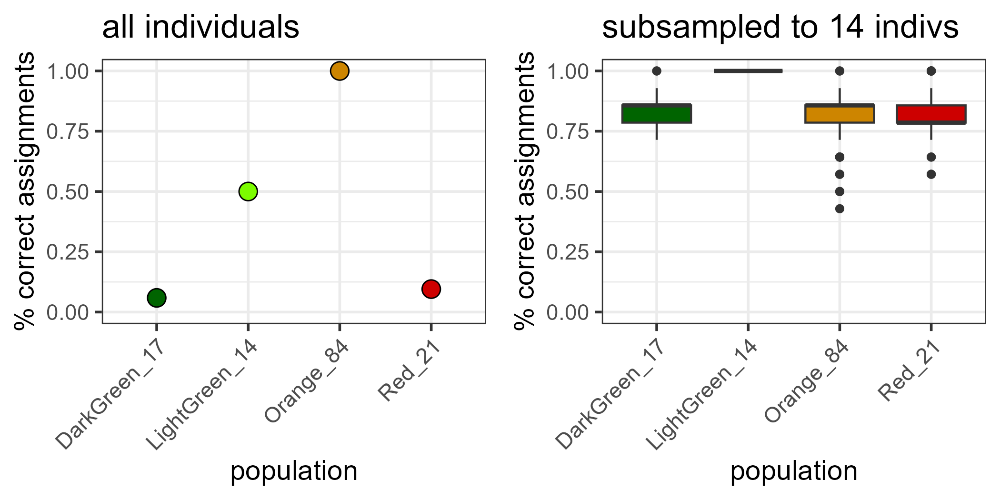
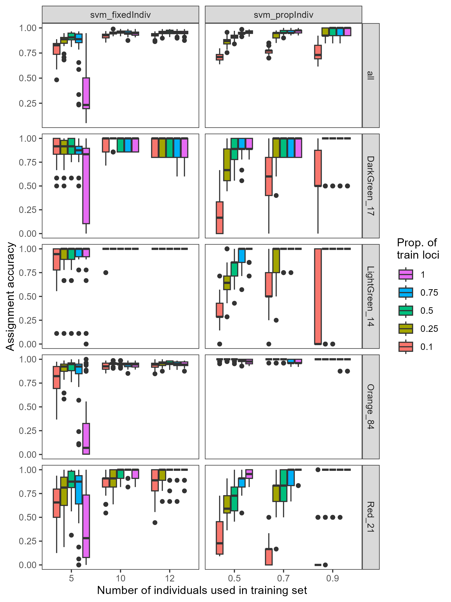

```{r setup, include=FALSE}
knitr::opts_chunk$set(echo = TRUE)
```


## population assignment for tursiops from NC

The goal here is to figure out if we can accurately assign individuals to populations.
And hopefully design GTseq panel to do this with additional individuals (not a part of this analysis directly).

I have taken 3 main approaches:

1. [rubias](https://github.com/eriqande/rubias)
2. [assignPOP](https://alexkychen.github.io/assignPOP/)
3. DAPC

Of these, I think either rubias or assignPOP should be used. The major difference between the two is that rubias uses a baysian assignment approach whereas assignPOP uses machine learning.

### strategy for determining accuracy

These are based on leave one out (LOO) or training testing analyses. Rubias has a LOO built in and assignPOP has training testing built in, so I'm just going to use these approaches for each. It makes my life simpler. If anything, I would think this should overestimate rubias accuracy and underestimate assignPOP. 

## rubias

See file `scripts/population_assignment_rubias.R`

Using all individuals as input, we get terrible assignment accuracy. This is expected and known as unequal sample sizes result in the largest sample having the highest confidence allele frequency estimates and all individuals get put into that population (see https://doi.org/10.1111/2041-210X.14286). 

To address this, I subset down all populations to the lowest population number (14), checked assignment accuracy using LOO, and did this 100x. This improves the results dramatically, despite the low pop numbers. Results for both below. 



## assignPOP

See file `scripts/population_assignment_assignPOP.R`

For this, we can cycle through:

1. All assignment methods
2. Number of individuals to include in the training set. Chosen by proportion or number of individuals to use in training (to even out sample sizes). 
3. Number of loci to include in the analysis (chosen by highest Fst)

This is a lot of combinations, so it looks kind of a mess. 

**the take home is that svm is clearly the best model**

### proportion of individuals in training set


### Fixed number of individuals in training set


### look only at svm:



Take home: **with low numbers of individuals, we can assign well with the top 10% of loci**. This is promising for designing snp panels, for example. 


## DAPC
